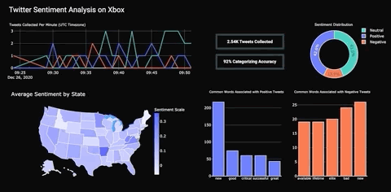

# Twitter-Sentiment-Analysis

## Introduction
Due to the high volume of tweets posted everyday, Twitter is an excellent source to collect product reviews about Xbox. Since Twitter is a social media platform, the data will consist of many internet slang, incomplete information, and misinformation. Analyzing these type of data leads to poor business results. However, after the raw data is properly handled, tweets can be represented in such a way to assist stakeholders into making insightful decisions and improve customer satisfaction.

## Objective
There are two objectives for this project:
1. Build an ETL pipeline
2. Create an interactive, real-time dashboard based on data collected from the ETL pipeline

## Getting Started
Apply for a Twitter developer account [here](https://developer.twitter.com/en/apply-for-access).  
After the request is approved, create an [app](https://developer.twitter.com/en/portal/apps/new) to get Twitter access keys and tokens.   
Input the keys and tokens into the [TwitterKeys.py](https://github.com/Ericjung008/Twitter-Sentiment-Analysis/blob/main/py%20files/TwitterKeys.py) file.
```
TwitterKeys.py
CONSUMER_KEY = 'Enter Twitter consumer key'
CONSUMER_SECRET = 'Enter Twitter consumer secret'
ACCESS_TOKEN = 'Enter Twitter access token'
ACCESS_TOKEN_SECRET = 'Enter Twitter access token secret'
```

Create an [AWS account](https://aws.amazon.com/rds/?did=ft_card&trk=ft_card).
```
awsDB.py
user = 'Enter your username here'
password = 'Enter your AWS password here'
db = 'Enter database name here'
host = 'Enter host link here'
port = '3306'
table = 'Entire desired table name here'
```

Install modules with the following command in your terminal: 
```
pip install -r requirements.txt
```

Replace the KEYWORD string value from [settings.py](https://github.com/Ericjung008/Twitter-Sentiment-Analysis/blob/main/py%20files/settings.py) with the word you want in tweets. 
```
settings.py
KEYWORD = 'Enter desired word to stream'
```

You have the option to add, remove, or change key-value pairs in [dictionary.py](https://github.com/Ericjung008/Twitter-Sentiment-Analysis/blob/main/py%20files/dictionary.py).  
Similarly, you can add or remove words in the list from [stopwords.py](https://github.com/Ericjung008/Twitter-Sentiment-Analysis/blob/main/py%20files/stopwords.py).

## Data
On a terminal window, run the following command:
```
python3 ETL.py
```

This will extract tweet data only if certain conditions are met. Next, the raw data will be cleaned and new features will be engineered. Finally, the transformed data will be loaded into a SQL database.

## Dashboard
Open another terminal terminal window and run the following command:
```
python3 app.py
```
To view your dashboard, click [here](http://127.0.0.1:8050/).
The link should direct you to an interactive, real-time dashboard.



## Acknowledgement
Special thanks to the Twitter organization for giving the opportunity to collect tweet data.
                                                                     
